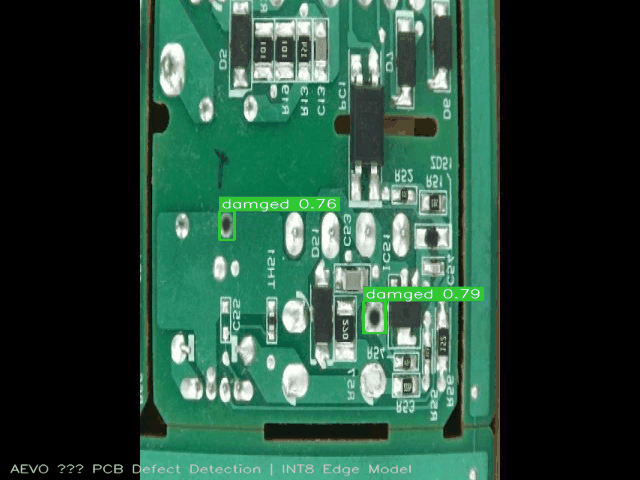
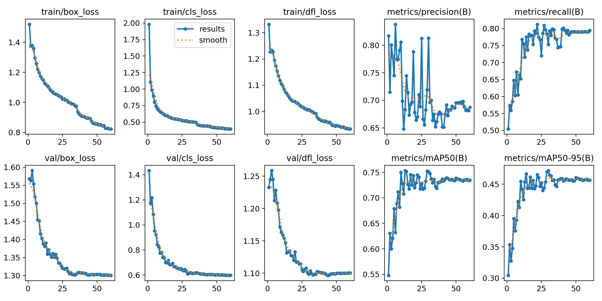
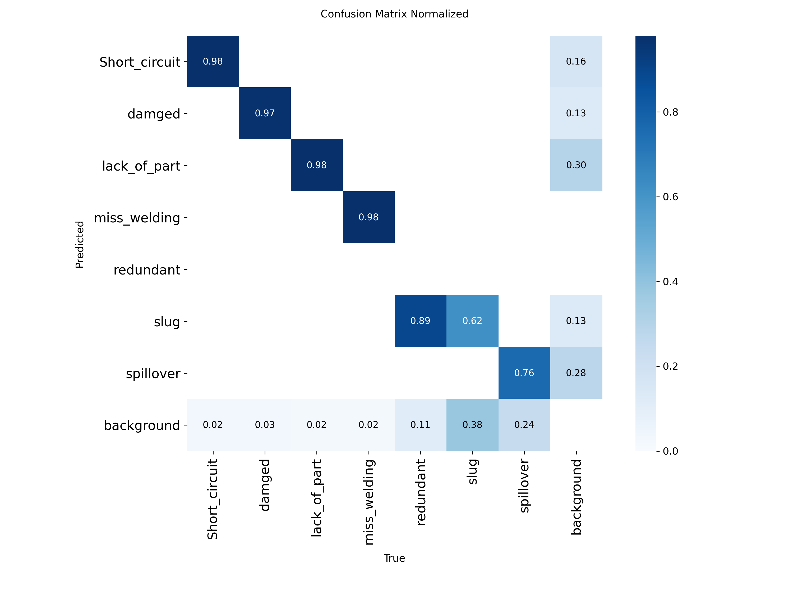
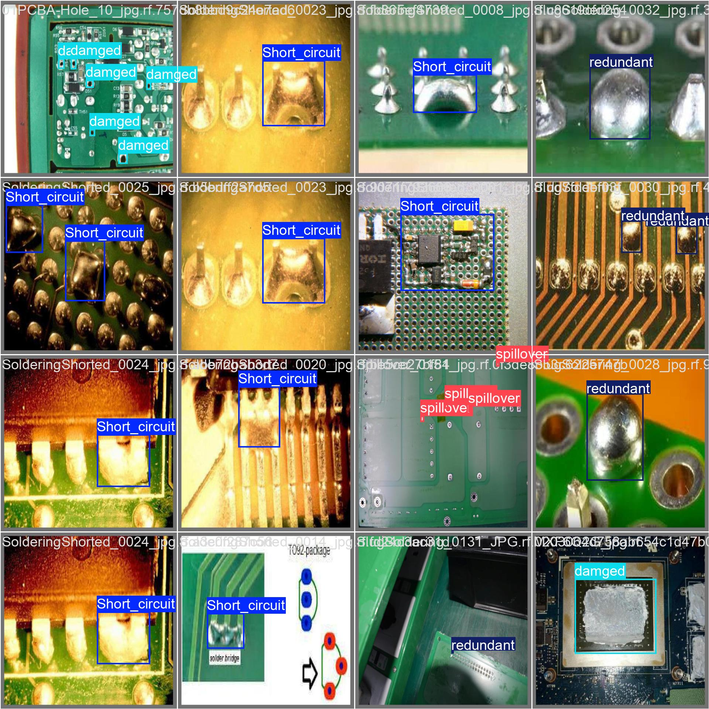
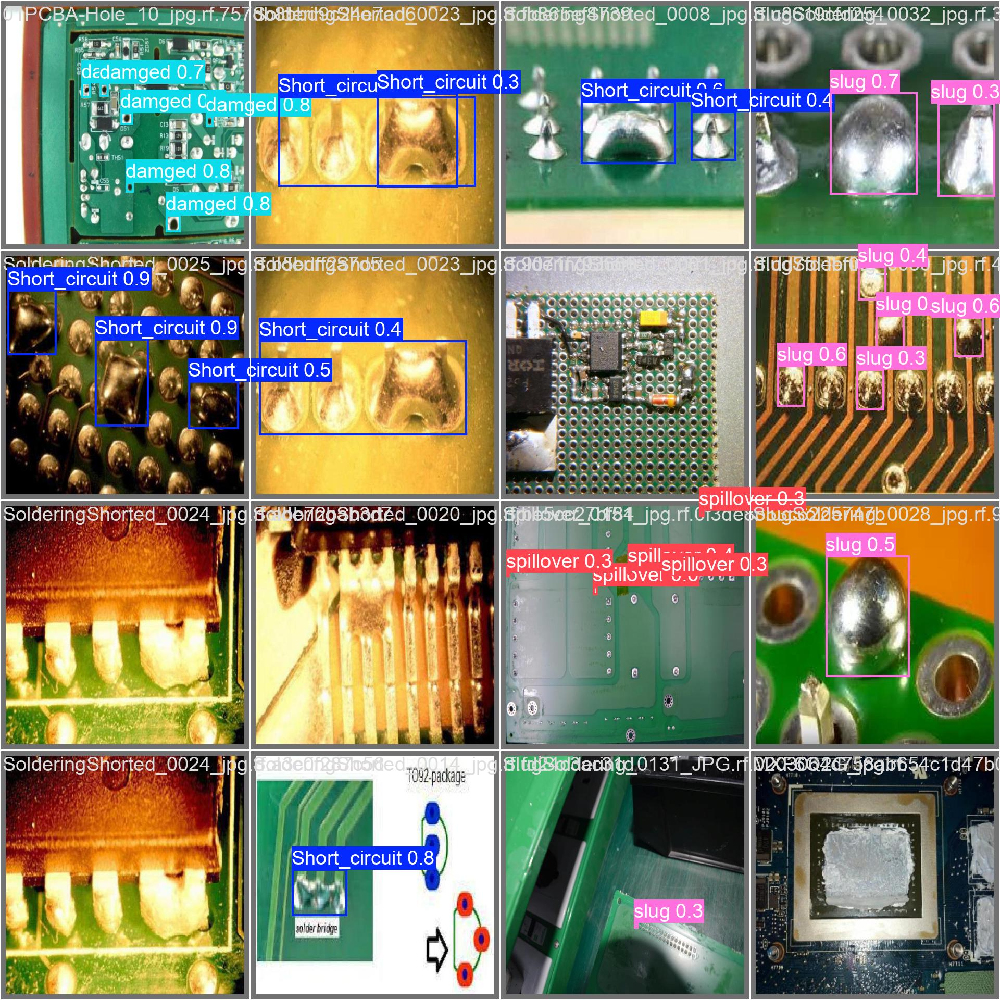
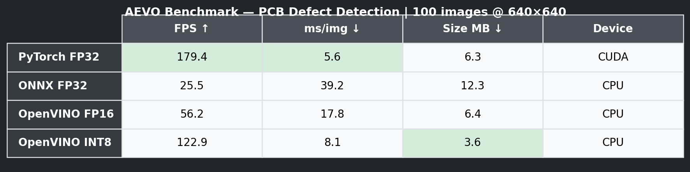
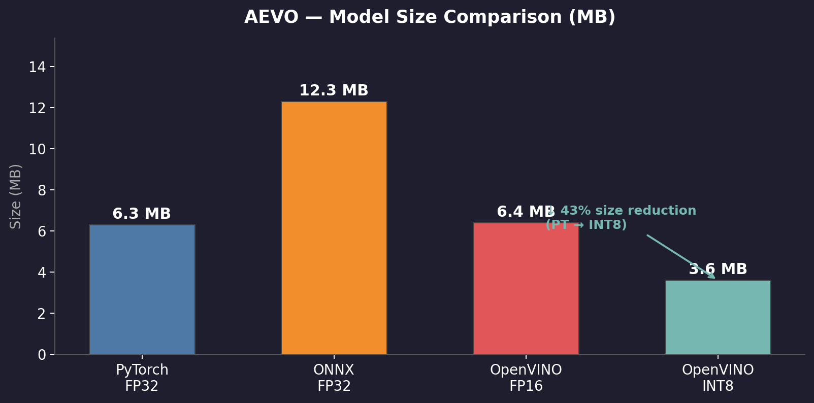

# AEVO — Agentic Edge-Vision Optimizer

> An autonomous MLOps pipeline that trains YOLOv8 models, uses the **Claude API** to self-optimize hyperparameters in real time, then compresses models for edge deployment — no human in the loop.

[](https://colab.research.google.com/github/RovoQ-design/AEVO/blob/main/notebooks/AEVO_colab.ipynb)


---

## Demo

[](https://youtu.be/b18SuaENFSc)

*Click to watch the full 94-second showcase*

---

## Live Detection



*YOLOv8n detecting 7 PCB defect classes in real time*

---

## What it does

AEVO trains a **PCB defect detection** model (YOLOv8n) on 22,476 real-world images across 7 defect classes. Every 5 epochs, it calls the **Claude API** to analyze training metrics and automatically adjust hyperparameters — then exports to ONNX and OpenVINO for edge deployment.

**Result:** Model compressed from 6.3 MB → 3.6 MB, running at **122.9 FPS on CPU** with under 2% accuracy drop.

---

## Training Results



| Metric | Value |
|--------|-------|
| Best mAP50 | **75.35%** |
| Best mAP50-95 | 47.17% |
| Best Precision | 81.3% |
| Best Recall | 79.3% |
| Epochs | 60 (early stop at patience=30) |
| Claude API calls | 12 |
| LR adjustments applied | 4 |

### Confusion Matrix



### Validation Predictions

| Ground Truth | Predictions |
|:---:|:---:|
|  |  |

### Claude Agent Decisions (sample)

```
Epoch  35 | reduce_lr x0.5  — "val mAP50 declined 0.7477→0.7224 over 5 epochs"
Epoch  45 | reduce_lr x0.6  — "mAP50 plateaued at 0.735–0.739 for 5 epochs"
Epoch  55 | reduce_lr x0.5  — "mAP50 steadily declined 0.7375→0.7333"
```

Full log: [`results/agent_decisions.txt`](results/agent_decisions.txt)

---

## Benchmark Results



```
╭───────────────┬─────────┬────────────┬─────────────┬──────────╮
│ Model         │   FPS ↑ │   ms/img ↓ │   Size MB ↓ │ Device   │
├───────────────┼─────────┼────────────┼─────────────┼──────────┤
│ PyTorch FP32  │   179.4 │        5.6 │         6.3 │ CUDA     │
│ ONNX FP32     │    25.5 │       39.2 │        12.3 │ CPU      │
│ OpenVINO FP16 │    56.2 │       17.8 │         6.4 │ CPU      │
│ OpenVINO INT8 │   122.9 │        8.1 │         3.6 │ CPU      │
╰───────────────┴─────────┴────────────┴─────────────┴──────────╯
```

**Platform:** NVIDIA RTX 3050 Ti (training) · Intel CPU (edge inference)

---

## Model Compression



| Format | Size | FPS (CPU) | Notes |
|--------|------|-----------|-------|
| PyTorch FP32 | 6.3 MB | 179 (CUDA) | Training checkpoint |
| ONNX FP32 | 12.3 MB | 25.5 | Cross-platform deployment |
| OpenVINO FP16 | 6.4 MB | 56.2 | Intel-optimized |
| OpenVINO INT8 | **3.6 MB** | **122.9** | Edge deployment target |

---

## Architecture

```
┌─────────────────────────────────────────────────────────┐
│                     AEVO Pipeline                        │
│                                                         │
│  [Dataset]  →  [Module 1: Data Hub]                    │
│                      │                                  │
│                       ▼                                 │
│  [Module 2: YOLOv8 Training Loop]                       │
│       │  every 5 epochs                                 │
│       ├──────────────────────────────────────────┐      │
│       │         [Module 3: Claude Agent]          │      │
│       │   analyze metrics → JSON action           │      │
│       │   → reduce_lr / adjust_momentum / continue│      │
│       └──────────────────────────────────────────┘      │
│                       │  best.pt (mAP50 > 70%)          │
│                       ▼                                 │
│  [Module 4: ONNX + OpenVINO Compression]               │
│       PyTorch FP32 → ONNX FP32 → OV FP16 → OV INT8    │
│                       │                                 │
│                       ▼                                 │
│  [Module 5: Benchmark Reporter]                         │
│       100-image inference · professional table          │
└─────────────────────────────────────────────────────────┘
```

---

## Dataset

- **Source:** PCB Defect Detection (Roboflow Universe)
- **Size:** 22,476 train · 383 val · 119 test images
- **Classes (7):** Short_circuit, damaged, lack_of_part, miss_welding, redundant, slug, spillover
- **Format:** YOLOv8 (normalized bounding boxes)

---

## Repo Structure

```
AEVO/
├── src/
│   ├── agent.py               # Modules 2+3 — YOLOv8 training + Claude agent loop
│   ├── benchmark.py           # Module 5 — inference benchmark reporter
│   └── data_hub.py            # Module 1 — dataset validation + augmentation
├── notebooks/
│   └── AEVO_colab.ipynb       # Interactive Colab notebook
├── exports/
│   ├── pcb_yolov8n.onnx       # ONNX FP32 model
│   ├── openvino_fp16/         # OpenVINO FP16 model (.xml + .bin)
│   └── openvino_int8/         # OpenVINO INT8 model (.xml + .bin)
├── runs/pcb_yolov8n/          # Training curves, confusion matrix, val predictions
├── results/                   # Benchmark table, training logs, agent decisions
├── artifacts/                 # Demo GIF, benchmark chart, model size chart
├── run_training.py            # Full pipeline entry point
├── run_module4.py             # Export PyTorch → ONNX → OpenVINO
└── run_module5.py             # Run 100-image benchmark
```

---

## How to Run

### 1. Install dependencies

```bash
pip install ultralytics anthropic onnxruntime openvino-dev tabulate opencv-python PyYAML
```

### 2. Set your Anthropic API key

```bash
export ANTHROPIC_API_KEY=your_key_here
```

### 3. Prepare dataset

Download the PCB Defect dataset from [Roboflow Universe](https://universe.roboflow.com) in YOLOv8 format and place it in `pcb_dataset/`.

```bash
python src/data_hub.py       # Validate structure + write dataset.yaml
```

### 4. Train with Claude agent loop

```bash
python run_training.py       # Modules 2+3: training + autonomous optimization
```

### 5. Export models

```bash
python run_module4.py        # Module 4: PyTorch → ONNX → OpenVINO
```

### 6. Benchmark

```bash
python run_module5.py        # Module 5: 100-image benchmark table
```

---

## Tech Stack

| Layer | Tools |
|-------|-------|
| Detection model | YOLOv8n (Ultralytics) |
| Agent / LLM | Claude Sonnet 4.6 (Anthropic) |
| Training | PyTorch · CUDA · AMP |
| Compression | ONNX · OpenVINO FP16 · OpenVINO INT8 |
| Inference | onnxruntime · openvino.runtime |
| Augmentation | OpenCV |

---

## Collaboration

For any collaboration or project enquiries, reach out to **RovoQ**:

🌐 [rovoq.online](https://rovoq.online)
💼 [linkedin.com/company/rovoq](https://www.linkedin.com/company/rovoq/)
📧 admin@rovoq.online

---

RovoQ © 2026
